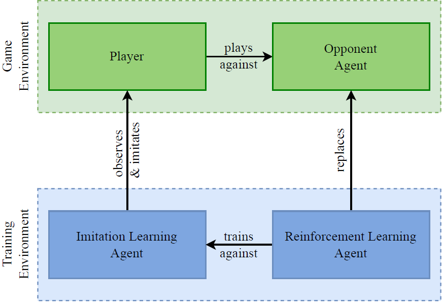

# Citation

This repository contains the code corresponding to our paper, **Personalized Dynamic Difficulty Adjustment - Imitation Learning Meets Reinforcement Learning**. 
It brings makes use of two agents, a reinforcement learner and an imitation learner. While the imitation learner copies the player's actions, the reinforcement learner
learns to beat the imitation learner in a separate thread. The resulting agent is the one the human plays against.



If you use this code in your research, please cite our paper:

```bibtex
@article{PDDA-Doc2024,
  title={Personalized Dynamic Difficulty Adjustment - Imitation Learning Meets Reinforcement Learning},
  author={Ronja Fuchs, Robin Gieseke, Alexander Dockhorn},
  journal={Proceedings of the IEEE Conference on Games 2024},
  year={2024},
  pages={1-2},
}
```


# Project Installation Guide

. Please follow the instructions below to set up your environment and run the code.

### Prerequisites

1. **Python Version**
    - Ensure you have Python >= 3.9 and < 3.12 installed. If your system doesn't have this version available, you can install it using `pyenv`.

2. **Java Runtime Environment**
    - An up-to-date installation of Java is necessary. If not installed, run:
      ```bash
      sudo apt install default-jre
      ```

3. **Poetry**
    - Poetry is used for dependency management. Install it on Ubuntu (Debian-based systems) using:
      ```bash
      sudo apt install python3-poetry
      ```

4. **Optional: Installing Python using pyenv**
    - If you need to install a specific Python version, follow these steps:

      a. Install prerequisites:
      ```bash
      sudo apt install -y make build-essential libssl-dev zlib1g-dev libbz2-dev libreadline-dev libsqlite3-dev wget curl llvm libncurses5-dev libncursesw5-dev xz-utils tk-dev libffi-dev liblzma-dev python3-openssl
      ```

      b. Install pyenv:
      ```bash
      curl https://pyenv.run | bash
      ```

      c. Add pyenv to autoload by editing your `~/.bashrc`:
      ```bash
      nano ~/.bashrc
      ```

      Add the following lines at the end of the file:
      ```bash
      export PYENV_ROOT="$HOME/.pyenv"
      [[ -d $PYENV_ROOT/bin ]] && export PATH="$PYENV_ROOT/bin:$PATH"
      eval "$(pyenv init --path)"
      eval "$(pyenv init -)"
      ```

      d. Restart your shell:
      ```bash
      exec "$SHELL"
      ```

      e. Install Python 3.11:
      ```bash
      pyenv install 3.11.9
      ```

      f. Set the installed version globally:
      ```bash
      pyenv global 3.11.9
      ```

      g. Configure Poetry to use the newly installed Python version:
      ```bash
      poetry env use 3.11.9
      ```

### Installation Steps

1. **Set Up the Virtual Environment**
    - Navigate to the root folder of this project and run:
      ```bash
      poetry install
      ```

    - If the installation gets stuck on "pending" for all packages, try deleting the lock file in your user cache and restart the previous command:
      ```bash
      find ~/.cache/pypoetry -name '*.lock' -type f -delete
      ```

    - If this doesn't resolve the issue, try disabling the keyring and running the installation again:
      ```bash
      poetry config keyring.enabled false
      poetry install
      ```

    - If Poetry fails to install some packages, try running the installation again, as it might be a dependency order issue.

2. **Activate the Virtual Environment**
    - Use the following command to spawn a new shell inside the virtual environment:
      ```bash
      poetry shell
      ```

    - Alternatively, in PyCharm or via the terminal, activate the environment:
        - Go to **Settings** -> **Python Interpreter** -> **Add Interpreter** -> **Add Local Interpreter** -> **Poetry Environment** -> Use existing environment -> Select `fightingice-ai`.

### Additional Setup

- **CUDA Setup (for GPU users)**
    - If you encounter the following error:
      ```bash
      libcublas.so.*[0-9] not found in the system path
      ```
      Install CUDA using:
      ```bash
      sudo apt-get install nvidia-cuda-toolkit nvidia-cuda-toolkit-gcc
      ```
      If the error persists, downgrade `torch` to version `2.0.0`:
      ```bash
      poetry add torch=2.0.0
      ```

### Running the Project

1. **Test Java Integration**
    - Before starting Python development, run the following command to test the Java setup:
      ```bash
      java -cp FightingICE.jar:./lib/*:./lib/lwjgl/*:./lib/lwjgl/natives/linux/amd64/*:./lib/grpc/*:./lib/lwjgl_util.jar Main --limithp 400 400 --inverted-player 1 --grpc
      ```
    - Select two keyboard players to fight against each other (`y / z` -> select in menu).

2. **Run Python Script**
    - Execute the `little_maestro.py` script to launch a new game window where two proxy agents will be selected to fight against each other:
      ```bash
      python little_maestro.py
      ```

    - If successful, the game should start with the proxy agents idle, awaiting user input.

### Troubleshooting

If you encounter any issues, feel free to contact us at the corresponding author’s email address.

---

